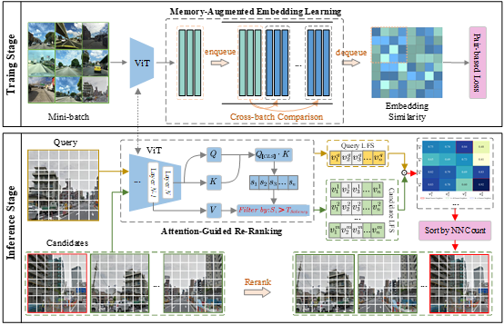

# Attention-Guided Visual Place Recognition with Memory-Enhanced Training

**Official PyTorch implementation**

[](https://www.python.org/)
[](https://pytorch.org/)
[](LICENSE)

---

## � Abstract

Robust visual place recognition (VPR) is crucial for autonomous navigation, but existing methods are often constrained by the trade-off between accuracy and efficiency. To address this challenge, we propose a unified framework implemented within a single Vision Transformer (ViT) model. In training, we leverage a memory queue stabilized by exponential decay weighting to perform hard negative mining, significantly enhancing the discriminability of global features. For inference, we introduce an attention-guided re-ranking strategy that re-purposes the internal attention and value representations of the trained ViT for salient region localization and local matching. This achieves precise re-ranking with near-zero overhead, avoiding the reliance on heavy, standalone modules in previous two-stage methods.

## 🎯 Key Contributions

### Training: Memory Queue with Exponential Decay Weighting

- **Cross-Batch Memory Bank**: Expands the negative sample pool from O(B) to O(M) where M is the memory size
- **Exponential Decay Weighting**: Stabilizes the memory queue by down-weighting outdated features
- **Hard Negative Mining**: Significantly enhances global feature discriminability through challenging sample selection

### Inference: Attention-Guided Re-ranking with Near-Zero Overhead

- **Internal Representation Re-use**: Leverages attention maps and value features from the trained ViT backbone
- **Saliency-based Region Selection**: Identifies discriminative regions without additional networks
- **Mutual Nearest Neighbor Matching**: Performs precise local matching for re-ranking
- **Minimal Computational Cost**: Achieves re-ranking without standalone local feature extractors

## ✨ Advantages

- **Unified Single-Model Framework**: Eliminates the complexity of two-stage methods with separate modules
- **Efficient Re-ranking**: Near-zero overhead by re-using internal ViT representations
- **Strong Discriminability**: Memory bank with exponential decay improves global feature quality
- **Flexible Configuration**: Supports multiple loss functions, datasets, and evaluation metrics
- **Reproducible**: Complete training and evaluation pipeline with detailed documentation

---

## 🖼️ Framework Overview



*Figure: Overview of our framework. **Top**: Memory-augmented embedding learning with cross-batch comparison during training. **Bottom**: Attention-guided re-ranking at inference stage, showing query processing, candidate retrieval, attention-based saliency extraction, and final re-ranking based on mutual nearest neighbor matching.*

---

## 📂 Repository Structure

```
RerankVPR/
├── main.py                          # Main entry: training/validation pipeline
├── arg_parser.py                    # Command-line argument configuration
├── environment.yaml                 # Conda environment specification
│
├── model/                           # Model definitions
│   ├── dinov2_backbone.py          # DINOv2 backbone (small/base/large/giant)
│   ├── dinov2_finetune.py          # Fine-tuning strategies
│   ├── model_interface_finetune.py # PyTorch Lightning training interface
│   └── aggregator/                 # Feature aggregators (e.g., GeM pooling)
│
├── losses/                          # Loss functions
│   ├── metric_loss.py              # Metric learning losses (MultiSimilarity/Triplet/Contrastive/NCA)
│   └── guided_matching_loss.py     # Guided matching loss (for re-ranking)
│
├── data/                            # Dataset interfaces
│   ├── data_interface.py           # Data module interface
│   ├── gsvcities_dataset.py        # GSV-Cities training set
│   ├── mapillary_dataset.py        # Mapillary validation set
│   ├── nordland_dataset.py         # Nordland validation set
│   └── ...                          # Other datasets (Tokyo 24/7, Pittsburgh, St Lucia, etc.)
│
├── utils/                           # Utility functions
│   ├── validation.py               # Validation and evaluation utilities
│   ├── hook_func.py                # Hook functions (extract attention/value)
│   └── call_backs.py               # PyTorch Lightning callbacks
│
└── logs/                            # Training logs and checkpoints
```

---

## 🚀 Getting Started

### Prerequisites

- Python 3.10
- PyTorch 2.0+
- CUDA 12.1+ (for GPU training)
- 32GB+ RAM recommended
- GPU with 24GB

### Installation

#### Option 1: Using Conda (Recommended)

```bash
# Clone the repository
git clone https://github.com/w-qilong/RerankVPR.git
cd RerankVPR

# Create conda environment
conda env create -f environment.yaml
conda activate wuqilong_lighting
```

#### Option 2: Manual Installation

```bash
# Create virtual environment
conda create -n rerankVPR python=3.10
conda activate rerankVPR

# Install PyTorch (adjust for your CUDA version)
pip install torch torchvision torchaudio --index-url https://download.pytorch.org/whl/cu121

# Install other dependencies
pip install pytorch-lightning pandas pillow tqdm prettytable matplotlib
pip install pytorch-metric-learning
```

### Dataset Preparation

#### Training Dataset: GSV-Cities

1. Download the [GSV-Cities](https://github.com/amaralibey/gsv-cities) dataset
2. Update the path in `data/gsvcities_dataset.py`:

```python
BASE_PATH = r'/path/to/your/GSV-Cities/'
```

The dataset should be organized as:

```
GSV-Cities/
├── Images/
│   ├── Bangkok/
│   ├── BuenosAires/
│   └── ...
└── dataframes/
    └── train.csv
```

#### Validation Datasets

The following benchmark datasets are supported (configure in `arg_parser.py`):

- **Mapillary SLS** (msls_val) - Street-level imagery
- **Tokyo 24/7** - Day/night condition changes
- **Pittsburgh 30k/250k** - Urban scenes
- **Nordland** - Seasonal variations
- **St Lucia** - Suburban environment
- **Gardens Point Walking** - Appearance changes
- **SVOX Night/Rain** - Adverse weather conditions
- **AmsterTime** - Temporal variations
- **ESSEX3IN1** - Multiple conditions
- **Eynsham** - Rural environment
- **SPED** - Special test scenarios

Place datasets in the `datasets/` directory and update paths in corresponding dataset files.

### Model Checkpoints

Pre-trained model checkpoints will be made available upon paper acceptance:

| Model       | Backbone     | Params | Mapillary R@1 | Tokyo24/7 R@1 | Pittsburgh R@1 | Download |
| ----------- | ------------ | ------ | ------------- | ------------- | -------------- | -------- |
| RerankVPR-S | DINOv2-Small | 22M    | TBD           | TBD           | TBD            | [Link](#)   |
| RerankVPR-B | DINOv2-Base  | 86M    | TBD           | TBD           | TBD            | [Link](#)   |
| RerankVPR-L | DINOv2-Large | 304M   | TBD           | TBD           | TBD            | [Link](#)   |

*Note: Download links and performance numbers will be updated after paper acceptance.*

### Pre-trained Models

Download DINOv2 pre-trained weights:

```bash
# DINOv2 Large (Recommended for best performance)
wget https://dl.fbaipublicfiles.com/dinov2/dinov2_vitl14/dinov2_vitl14_pretrain.pth -P pretrained_model/dinov2_large/

# Alternatively, models will be automatically downloaded from torch.hub
```

---

## 🎓 Training

### Basic Training Command

```bash
python main.py \
    --model_name dinov2_backbone \
    --backbone_size dinov2_large \
    --finetune_last_n_layers 4 \
    --train_dataset gsvcities_dataset \
    --train_batch_size 64 \
    --epochs 30 \
    --lr 1e-5 \
    --optimizer adamw \
    --lr_scheduler exp \
    --gamma 0.99 \
    --use_memory_bank True \
    --memory_bank_size 16384 \
    --decay_lambda 0.1 \
    --memory_bank_start_epoch 5 \
    --metric_loss_function MultiSimilarityLoss \
    --miner_name MultiSimilarityMiner \
    --miner_margin 0.1
```

### Key Hyperparameters

#### Model Configuration

- `--backbone_size`: ViT model size (`dinov2_small`/`dinov2_base`/`dinov2_large`/`dinov2_giant`)
- `--finetune_last_n_layers`: Number of layers to fine-tune (recommended: 4-6)

#### Memory Bank Configuration

- `--use_memory_bank`: Enable Cross-Batch Memory Bank (highly recommended)
- `--memory_bank_size`: Memory queue size (default: 16384)
- `--decay_lambda`: Exponential decay coefficient (default: 0.1, smaller = faster decay)
- `--memory_bank_start_epoch`: Epoch to start using memory bank (default: 5)

#### Loss Function

- `--metric_loss_function`: Metric learning loss (`MultiSimilarityLoss`/`TripletMarginLoss`/`ContrastiveLoss`/`NCALoss`)
- `--miner_name`: Hard negative miner (`MultiSimilarityMiner`/`TripletMarginMiner`)
- `--miner_margin`: Mining margin threshold (default: 0.1)

#### Training Strategy

- `--train_batch_size`: Batch size (default: 64)
- `--img_per_place`: Number of images per place (default: 4)
- `--warmup_steps`: Learning rate warmup steps (default: 200)

### Training Tips

1. **Memory Bank Start Epoch**: Start memory bank after initial convergence (epoch 5-10)
2. **Decay Lambda**: Lower values (0.05-0.1) prioritize recent features, higher values (0.2-0.5) retain more history
3. **Fine-tuning Layers**: More layers = better performance but slower training and higher memory
4. **Batch Size**: Larger batches provide more negatives but require more VRAM

---

## 🧪 Evaluation and Re-ranking

### Evaluation Only (No Re-ranking)

```bash
python main.py \
    --ckpt_path logs/dinov2_backbone_dinov2_large/checkpoints/best.ckpt \
    --eval_datasets mapillary_dataset tokyo247_dataset \
    --rerank False
```

### With Attention-Guided Re-ranking

```bash
python main.py \
    --ckpt_path logs/dinov2_backbone_dinov2_large/checkpoints/best.ckpt \
    --eval_datasets mapillary_dataset \
    --rerank True \
    --saliency_thresh 0.3 \
    --nn_match_thresh 0.65 \
    --facet_layer_and_facet "{22: 'value', 23: 'attn'}" \
    --include_cls False \
    --bin False \
    --hierarchy 2
```

### Re-ranking Parameters

- `--saliency_thresh`: Saliency threshold [0-1] to filter low-attention regions
- `--nn_match_thresh`: Nearest neighbor matching threshold [0-1] for match strictness
- `--facet_layer_and_facet`: Which layers and features to extract (format: `{layer_id: 'attn'/'value'/'token'}`)
- `--include_cls`: Whether to include CLS token (default: False)

---

## 📊 Results Visualization

The repository includes Jupyter notebooks for comprehensive result analysis:

```
1_visual_head_attention.ipynb      # Visualize attention heads
2_visual_pca_map.ipynb             # PCA dimensionality reduction
3_find_corresponds.ipynb           # Find corresponding points
4_visual_similarity.ipynb          # Similarity analysis
6_visual_negative_samples.ipynb    # Negative sample analysis
14_visual_param_heatmap.ipynb      # Hyperparameter heatmaps
15_analyze_negative_samples.ipynb  # Negative sample statistics
```

---

## 🔬 Method Overview

### Training: Memory Queue with Exponential Decay

```
┌─────────────────────────────────────────────────────┐
│  Current Batch Features                             │
│  ┌───┐ ┌───┐ ┌───┐ ┌───┐                           │
│  │ f1│ │ f2│ │ f3│ │...│                           │
│  └───┘ └───┘ └───┘ └───┘                           │
└─────────────────────────────────────────────────────┘
                    │
                    ▼
┌─────────────────────────────────────────────────────┐
│  Cross-Batch Memory Queue (Size: 16384)            │
│  ┌────────────────────────────────────────────┐    │
│  │ Older Features (Decay Weight: e^(-λt))    │    │
│  │ ┌───┐ ┌───┐ ┌───┐         ┌───┐          │    │
│  │ │ f │ │ f │ │ f │   ...   │ f │          │    │
│  │ │-N │ │-N+1│ │-N+2│        │-1 │          │    │
│  │ └───┘ └───┘ └───┘         └───┘          │    │
│  └────────────────────────────────────────────┘    │
└─────────────────────────────────────────────────────┘
                    │
                    ▼
┌─────────────────────────────────────────────────────┐
│  Hard Negative Mining (MultiSimilarity Miner)      │
│  • Mine hard negatives from batch + memory queue   │
│  • Exponential decay ensures recent samples        │
│    have higher weights                             │
└─────────────────────────────────────────────────────┘
```

**Advantages**:

- Expands negative pool from O(B) single batch to O(M) (M = memory size)
- Exponential decay prevents outdated features from dominating training
- Enables large-scale contrastive learning with limited GPU memory

### Inference: Attention-Guided Re-ranking

```
Query Image                    Reference Image
     │                              │
     ├─────────────┬────────────────┤
     │             │                │
     ▼             ▼                ▼
┌─────────┐  ┌──────────┐   ┌─────────┐
│ DINOv2  │  │ Extract  │   │ DINOv2  │
│ Forward │  │ Attention│   │ Forward │
│         │  │ & Value  │   │         │
└─────────┘  └──────────┘   └─────────┘
     │             │                │
     ▼             ▼                ▼
┌─────────────────────────────────────┐
│ Saliency Map (from Attention)       │
│ [CLS Token Attention → Avg Heads]   │
│    ┌─┬─┬─┬─┬─┬─┐                   │
│    │█│▓│▒│░│ │ │ ...               │
│    └─┴─┴─┴─┴─┴─┘                   │
└─────────────────────────────────────┘
     │
     ▼ (Thresholding: > saliency_thresh)
┌─────────────────────────────────────┐
│ Salient Patch Features (Value)      │
│ [B, C, Top-K Patches]               │
└─────────────────────────────────────┘
     │
     ▼
┌─────────────────────────────────────┐
│ Mutual Nearest Neighbor Matching    │
│ • Compute similarity matrix         │
│ • Find reciprocal matches           │
│ • Count valid matches               │
└─────────────────────────────────────┘
     │
     ▼
┌─────────────────────────────────────┐
│ Re-ranked Results                   │
└─────────────────────────────────────┘
```

**Advantages**:

- No need for additional local feature extractors (e.g., SuperPoint, SuperGlue)
- Directly re-uses internal ViT representations with near-zero overhead
- Attention provides semantic saliency, Value provides discriminative features

---

## 📈 Performance Metrics

The framework supports the following evaluation metrics:

- **Recall@K**: Top-K retrieval accuracy (K=1, 5, 10)
- **Inference Time Analysis**:
  - Feature extraction time (per image)
  - Retrieval time (per query)
  - Re-ranking time (per query)

### Example Output

```
Validation Results (Mapillary):
  Recall@1:  92.5%
  Recall@5:  97.8%
  Recall@10: 98.9%

Re-ranking Results (saliency=0.3, nn_match=0.65):
  Recall@1:  94.2% (+1.7%)
  Recall@5:  98.5% (+0.7%)
  Recall@10: 99.3% (+0.4%)

Inference Time:
  Feature Extraction: 0.015s/img (66.7 imgs/sec)
  Retrieval:          0.003s/query
  Re-ranking:         0.008s/query
```

---

## ️ Advanced Configuration

### Multi-Dataset Training

Modify `--train_dataset` in `arg_parser.py` to support multiple training datasets:

```python
parser.add_argument(
    "--train_dataset",
    default=["gsvcities_dataset", "mapillary_dataset"],
    type=list
)
```

### Custom Dataset Integration

1. Create a new dataset file in `data/` directory (e.g., `my_dataset.py`)
2. Inherit from `torch.utils.data.Dataset` and implement `__getitem__` and `__len__`
3. Register the new dataset in `data_interface.py`
4. Add to `--eval_datasets` in `arg_parser.py`

**Example Custom Dataset**:

```python
from torch.utils.data import Dataset
from PIL import Image

class MyDataset(Dataset):
    def __init__(self, base_path, transform=None):
        self.base_path = base_path
        self.transform = transform
        # Load your dataset metadata
  
    def __getitem__(self, index):
        # Load and return image
        img_path = self.base_path / self.image_paths[index]
        img = Image.open(img_path).convert('RGB')
        if self.transform:
            img = self.transform(img)
        return img, self.labels[index]
  
    def __len__(self):
        return len(self.image_paths)
```

### Loss Function Extension

Add new loss functions in `losses/metric_loss.py`:

```python
loss_configs = {
    "YourCustomLoss": {
        "loss": YourLossFunction(params),
        "miner": YourMiner() or None,
    }
}
```

---

## 📝 Citation

If you use this code in your research, please cite:

```bibtex
@article{rerankVPR2024,
  title={Robust Visual Place Recognition with Attention-Guided Re-ranking and Memory-Enhanced Training},
  author={Your Name},
  journal={arXiv preprint arXiv:xxxx.xxxxx},
  year={2024}
}
```

---

## 🙏 Acknowledgments

This project builds upon excellent work from:

- [**DINOv2**](https://github.com/facebookresearch/dinov2): Self-supervised vision foundation model by Meta AI
- [**PyTorch Metric Learning**](https://github.com/KevinMusgrave/pytorch-metric-learning): Comprehensive metric learning library
- [**GSV-Cities**](https://github.com/amaralibey/gsv-cities): Large-scale street-view dataset for VPR
- [**PyTorch Lightning**](https://lightning.ai/): Streamlined deep learning training framework

Special thanks to the computer vision community for developing robust VPR benchmarks.

---

## 📄 License

This project is released under the MIT License. See the [LICENSE](LICENSE) file for details.

---

## 📧 Contact

For questions, issues, or collaboration opportunities:

- **GitHub Issues**: [Submit an issue](https://github.com/w-qilong/RerankVPR/issues)
- **Email**: your.email@example.com
- **Paper**: [arXiv:xxxx.xxxxx](https://arxiv.org/abs/xxxx.xxxxx) *(to be released)*

---

## 🔄 Changelog

### v1.0.0 (2024-11)

- ✅ Initial public release
- ✅ DINOv2 backbone support (small/base/large/giant)
- ✅ Memory queue with exponential decay weighting
- ✅ Attention-guided re-ranking
- ✅ Multi-dataset evaluation framework
- ✅ Complete training and inference pipeline
- ✅ Comprehensive documentation and examples

---

## 🌟 Star History

If you find this project helpful, please consider giving it a star ⭐!

[](https://star-history.com/#w-qilong/RerankVPR&Date)

---

## ❓ FAQ & Troubleshooting

### Common Issues

**Q: Out of Memory (OOM) errors during training**

```
A: Try the following:
   1. Reduce batch size: --train_batch_size 32 (or 16)
   2. Reduce memory bank size: --memory_bank_size 8192
   3. Use smaller backbone: --backbone_size dinov2_base
   4. Enable gradient accumulation: --gradient_accumulate True --gradient_accumulate_factor 2
```

**Q: DINOv2 model download fails**

```
A: Manually download from Facebook's repository:
   wget https://dl.fbaipublicfiles.com/dinov2/dinov2_vitl14/dinov2_vitl14_pretrain.pth
   Place in pretrained_model/dinov2_large/
```

**Q: Re-ranking is too slow**

```
A: Re-ranking speed depends on:
   1. Number of candidates (reduce top-K in first stage retrieval)
   2. Image resolution (use --image_size_eval [224, 224] instead of [322, 322])
   3. Batch processing (process multiple queries at once)
```

**Q: Low Recall@1 on custom dataset**

```
A: Check the following:
   1. Dataset format matches expected structure
   2. Ground truth positives are correctly defined
   3. Image normalization is consistent (mean=[0.485, 0.456, 0.406], std=[0.229, 0.224, 0.225])
   4. Model is properly fine-tuned (not just pre-trained weights)
```

**Q: How to reduce training time?**

```
A: Optimization strategies:
   1. Use smaller backbone initially: --backbone_size dinov2_base
   2. Reduce epochs: --epochs 20
   3. Start memory bank earlier: --memory_bank_start_epoch 3
   4. Use fewer validation datasets during training
```

### Known Limitations

- **Memory Bank Warmup**: Requires 5-10 epochs for optimal performance
- **Re-ranking Overhead**: Increases linearly with number of candidates (top-K)
- **Dataset Scale**: Very large datasets (>1M images) may require distributed training
- **Fine-tuning Stability**: Fine-tuning too many layers (>6) may cause training instability

### Performance Tips

1. **Best Accuracy**: Use `dinov2_large` or `dinov2_giant` with `--finetune_last_n_layers 6`
2. **Best Speed**: Use `dinov2_base` with `--finetune_last_n_layers 2` and skip re-ranking
3. **Balanced**: Use `dinov2_large` with `--finetune_last_n_layers 4` (default configuration)

---

## 🤝 Contributing

We welcome contributions! Please feel free to submit a Pull Request. For major changes:

1. Fork the repository
2. Create your feature branch (`git checkout -b feature/AmazingFeature`)
3. Commit your changes (`git commit -m 'Add some AmazingFeature'`)
4. Push to the branch (`git push origin feature/AmazingFeature`)
5. Open a Pull Request

---

**Developed with ❤️ for the VPR research community**
